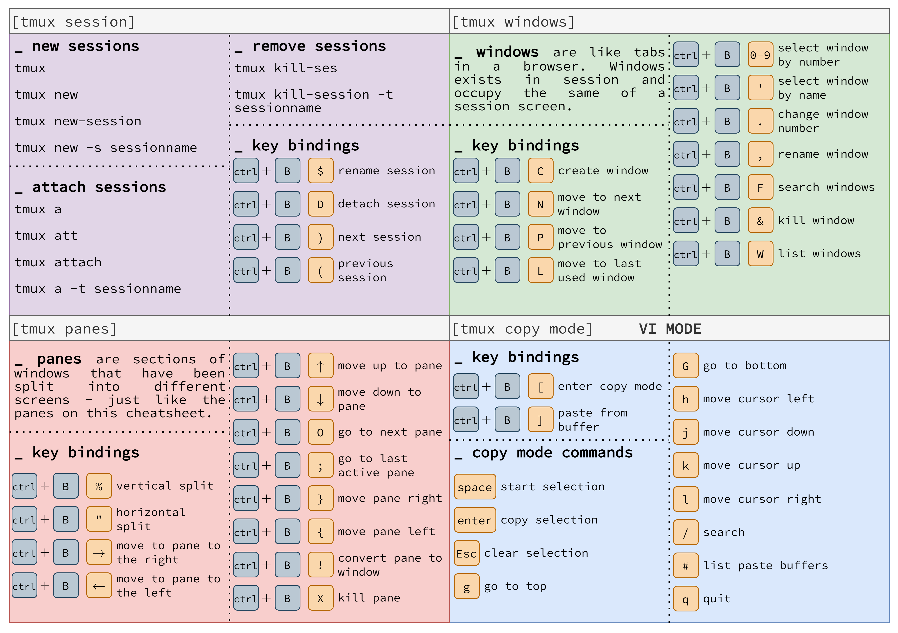

# Terminal Multiplexer
Multiplex your terminal experience. **Tmux** is great and worth it to learn. Will allow you to utilize multiple terminal windows at the same time and keep processes running in the background without accidentally killing your scan and having to start over.

# Config
Can setup a config file at `~/.tmux.conf`

1. Turn on mouse support - *Caution this is buggy*
```bash
echo "set -g mouse on" >> ~/.tmux.conf
```
When scrolling breaks something hit `q` to "quit" out.

2. If you would like VI mode to be permanently enabled, add this line to your `~/.tmux.conf`:
```bash
echo "set-window-option -g mode-keys vi" >> ~/.tmux.conf
```

---

# VI mode Cheat Sheet


# Default Cheat Sheet


---

### For images, Credit to **LEGOL2** on [Reddit](https://www.reddit.com/user/LEGOL2/)

---
